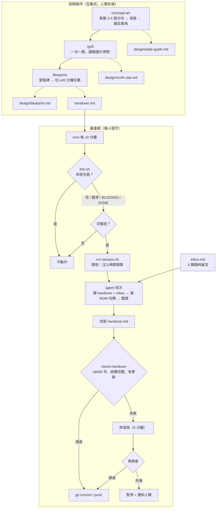

# 設計說明

這份文件說明 Handover Game Studio 的整體樣貌：它要解決什麼問題、分成哪些階段、每個機制為什麼這樣設計，以及 Claude Code 和 Codex 該怎麼選。

---

## 1. 要解決的兩個問題

| 問題 | 症狀 | 對策 |
|---|---|---|
| **溝通頻寬**：人類是視覺動物，純文字的遊戲設計討論很容易雞同鴨講 | agent 做出來的「像素風」「療癒」跟你腦中的完全不同 | **先生圖再討論**：所有設計對話都錨定在具體的圖上（「圖 B 的色調 + 圖 D 的鏡頭角度」） |
| **長程任務**：一款遊戲遠超過單一 agent session 的 context 與注意力 | 越做越歪、重複踩同樣的坑、context 爆掉後失憶 | **北極星 + 交班制**：固定不動的目標 + 有字數上限、持續改寫的交班檔 + 每班只做一件做得完的事 |

---

## 2. 全流程



---

## 3. 前期製作

### 3.1 `/concept-art` — 先有圖

Claude/Codex 本身不直接生圖，所以用 `tools/imagegen.py` 呼叫生圖 API（OpenAI `gpt-image-1` 或 Google Gemini image），agent 再用多模態能力「看」自己生出來的圖，和人類討論。

三輪節奏：

1. **發散**：從使用者一句話的點子出發，生成 3-4 張**同一個場景、不同美術方向**的圖（例如：像素 / 低多邊形 / 手繪水彩 / 版畫）。同場景才能比較風格而非內容。
2. **收斂**：使用者挑選、混搭（「A 的色彩 + C 的線條」），生成：
   - 主視覺（key art）
   - 角色設定圖
   - 環境 / 關卡氛圍圖
   - **假遊戲截圖**（含 HUD、鏡頭角度）← 最能傳達「玩起來長什麼樣」的一張，直接逼出鏡頭、操作、介面密度等玩法問題
3. **鎖定**：把定案的視覺語言寫成 `design/style-guide.md`：色票、形狀語言、光影、參考、**生圖 prompt 前綴配方**（後續生成美術素材時保持一致）。

每張圖都存成 `design/concept/NNN-slug.png` + 同名 `.json`（prompt、模型、輪次、備註），`tools/concept_board.py` 會生成 `board.html` 讓人類並排比較。圖片同時會是量產期的**視覺北極星**：agent 截遊戲畫面後會拿來和概念圖對照。

### 3.2 `/grill` — 拷問到共識

借鏡 obra/superpowers 的 brainstorming 與 grill-me 的做法：

- **一次只問一題**，盡量給選項 + 推薦答案（降低使用者負擔）。
- **錨定在圖上**：「在假截圖裡，玩家是從這個 45° 視角操控船嗎？」
- 必問的面向：玩家幻想（player fantasy）、核心循環（30 秒 / 5 分鐘 / 一局）、操作與平台、勝負與進程、世界觀與背景故事、目標玩家、**明確不做什麼**、範圍與完成的定義。
- 使用者答「隨便」時，agent 要給出主張並說明理由，而不是略過。
- 結束條件：agent 能寫出北極星草稿，**且使用者逐條確認**。

產出 `design/north-star.md`：

- **一句話北極星**（「玩家在 15 分鐘內，划船穿過沉沒城市，為居民送出最後的信，感受到溫柔的告別」）
- 3-5 條**設計支柱**（每個決策都要能回溯到某條支柱）
- **反目標**（明確不做：沒有戰鬥、沒有線上功能…）
- **完成定義**：可檢驗的條目（可從頭玩到尾、跑在瀏覽器 60fps、…）

北極星由人類核准，**量產期 agent 不得自行修改**，只能在 handover 的「等待人類」區提出修改建議。

### 3.3 `/blueprint` — 從北極星到可執行任務

1. 寫 `design/blueprint.md`：技術選型、架構草圖、里程碑（M0 骨架 → M1 灰盒核心循環 → M2 垂直切片 → M3 內容量產 → M4 打磨），每個里程碑有**驗收條件**。
2. 只把**當前里程碑**切成任務（後面的里程碑只列粗項，等接近時再切 — 避免過早規劃）。
3. 用 `templates/handover.md` 產出第一版 `handover.md`，跑 `harness/bin/check-handover` 驗證。
4. 請使用者審閱，然後 `harness/studio install-cron`。

---

## 4. 交班檔 `handover.md`

### 4.1 為什麼要上限 8000 字元

交班檔是**每一班開頭都會完整讀入**的唯一記憶。沒有上限，它會像日誌一樣無限膨脹，最後變成新的 context 負擔、重點被稀釋。8000 字元（中文約 2-3 千個 token）的限制逼 agent 做**編輯**而非**記錄**：每一班都要決定什麼值得留下。

溢出規則：

| 內容 | 太多時去哪 |
|---|---|
| 過時或已被吸收的「坑」 | `docs/lessons.md`（無上限，按需 grep） |
| 已完成的任務 | 直接刪；git log 就是歷史 |
| 舊的班次紀錄 | 只保留最近 5 班，每班 1-2 行 |
| 詳細的技術筆記 | `docs/` 下的專題文件，handover 只留連結 |

`git log -p handover.md` 就是完整的交班歷史，所以刪除不會真的遺失資訊。

### 4.2 結構

每個區段都有一個穩定的英文標記（`NORTH_STAR`、`TASKS` …），讓 `check-handover` 可以驗證結構，中文標題則可以自由調整。

```
STATUS: ACTIVE | BLOCKED | DONE
## 北極星 NORTH_STAR       一句話 + 目前里程碑與其驗收條件
## 目前狀態 STATE           遊戲現在能做什麼、怎麼跑、怎麼驗證
## 任務佇列 TASKS           NOW（恰好一個）/ NEXT / LATER
## 坑 PITFALLS              踩過的雷 + 怎麼避開
## 有效做法 PLAYBOOK        驗證過的做法、指令、慣例
## 等待人類 HUMAN           需要人類決定的事 + 決策紀錄
## 班次紀錄 LOG             最近 5 班，每班 1-2 行
```

任務格式：

```
- [T-014] 船隻划槳物理：加速度與水阻 | ~30m | 驗收：WASD 可划、放開後 2 秒內滑停、npm test 綠燈 | 依賴 T-012
```

### 4.3 任務大小

每班 45 分鐘，扣掉開班（讀 handover、跑遊戲確認狀態，~5 分鐘）與收班（驗證、改寫 handover、commit，~8 分鐘），實際可用約 **30 分鐘**。規則：

- 任務必須有**可驗證的驗收條件**（指令、測試、截圖比對）。
- 開班時若判斷 NOW 任務做不完，**第一件事是把它切小**，改寫 handover 後只做第一塊。
- 做到一半時間不夠：停下，把進度與下一步寫進 NOW 任務，而不是硬塞。

---

## 5. Harness

### 5.1 定時啟動與「有班就不動」

```
cron */10 * * * *  →  harness/tick.sh
```

`tick.sh` 的判斷順序：

1. `flock` 取得 tick 鎖（避免兩個 tick 同時進來）。
2. `.studio/PAUSE` 存在 → 不動。
3. `.studio/session.env` 存在：
   - 其 PID 還活著 → **有班在跑，不動**。
   - 活著但超過硬截止時間 + 寬限 → 殺掉整個 process group（防止卡死）。
   - PID 已死 → 殘留鎖，清掉並記錄「上一班異常結束」。
4. `handover.md` 的 `STATUS:` 為 `BLOCKED` 或 `DONE` → 不動（並透過 `NOTIFY_CMD` 通知一次）。
5. 超過每日班次上限 → 不動（控制花費）。
6. 以 `setsid` 在背景啟動 `run-session.sh`。

為什麼用 cron + PID 鎖而不是一個常駐迴圈：常駐迴圈掛掉就全停；cron 是無狀態的，機器重開、腳本崩潰後都會自動恢復，而狀態全在檔案系統上，可觀察、可手動干預。

### 5.2 時間注入

agent 本身沒有時間感，harness 用三層機制讓它知道自己還剩多少時間：

| 層 | 機制 | Claude Code | Codex |
|---|---|---|---|
| 開班 | prompt 內寫明開始時間、軟截止、硬截止 | ✅ | ✅ |
| 途中 | `PostToolUse` hook 在跨過 15/10/5 分鐘等門檻時注入「剩餘 N 分鐘」 | ✅ | ❌（改為指示 agent 定期執行 `harness/bin/time-left`） |
| 強制 | `timeout` 在硬截止時終止 process group | ✅ | ✅ |

時間線（預設值）：

```
0 ────────────── 37 ─────── 45 ────── 50
開班            軟截止      硬截止    kill
                (開始收班)  (應已交班) (timeout --kill-after)
```

### 5.3 收班閘門

agent 可能忘記更新交班檔、或寫超過 8000 字。兩道防線：

1. **Claude Code `Stop` hook**：agent 想結束時，執行 `check-handover --since <開班時間>`；不通過就 `block` 並告訴它哪裡不合格，讓它當場修（最多擋 3 次，避免無窮迴圈）。
2. **Harness 事後檢查**（兩種 agent 都適用）：不通過 → 開一個 5 分鐘的**修復班**，只做壓縮與修正；仍不通過 → 暫停並通知人類。

被 timeout 強制中止的班次，harness 會把「上一班被強制中止，工作區可能有未完成的修改」寫進下一班的 prompt，並把殘留修改以 `wip:` commit 保存（不丟任何東西）。

### 5.4 人類介入點

| 想做的事 | 方式 |
|---|---|
| 給回饋 / 改方向 | 寫進 `inbox.md`，下一班開頭處理並清空 |
| 回答 agent 的問題 | 編輯 handover 的 `HUMAN` 區，把 `STATUS` 改回 `ACTIVE` |
| 暫停 / 恢復 | `harness/studio pause` / `resume` |
| 看進度 | `harness/studio status`、`git log`、遊戲截圖（`game/screenshots/`） |
| 改北極星 | 只有人類改 `design/north-star.md`，並在 inbox 告知 |

---

## 6. 選 Claude Code 還是 Codex？

**建議：量產期用 Claude Code 當主力，生圖用 OpenAI 或 Gemini 的圖像 API；Codex 作為可切換的替代 adapter。**

| 面向 | Claude Code | Codex CLI |
|---|---|---|
| 無頭執行 | `claude -p` | `codex exec` |
| 專案守則 | `CLAUDE.md`（本專案引入 `AGENTS.md`） | `AGENTS.md` |
| Skills | `.claude/skills/*/SKILL.md` 原生支援，`/grill` 直接呼叫 | 請它讀同一份 SKILL.md 照做 |
| **Hooks（本設計的關鍵）** | `SessionStart` / `PostToolUse` / `Stop` 可以**強制**時間注入與收班閘門 | 較有限 → 靠 prompt 指示 + harness 事後檢查 |
| 看圖（截圖對照概念圖） | ✅ 多模態讀檔 | ✅ |
| 生圖 | ❌ 需外部 API | 同生態系有 gpt-image，但仍透過 API 最穩 |

Hooks 讓「時間注入」與「交班品質」從**請 agent 自律**變成**harness 強制保證**，這是選 Claude Code 當主力的主因。兩者可以混用：`config.sh` 設 `AGENT=codex` 即可切換，交班檔格式完全相同，甚至可以讓兩種 agent 輪流接班。

---

## 7. 遊戲技術選型建議

建議 **Web 技術（TypeScript + Vite + Phaser 3 或 Three.js）**，原因都跟「agent 能否自我驗證」有關：

- 無頭瀏覽器（Playwright）可以**截圖** → agent 用多模態比對截圖與概念圖，這是把「視覺北極星」接進量產迴圈的關鍵。
- 可以寫自動化遊玩測試（模擬按鍵、斷言遊戲狀態）。
- 沒有編輯器 GUI、全部是文字檔 → agent 可以完全掌控（相比 Unity/Godot 場景檔）。
- 人類打開瀏覽器就能玩到最新版。

M0 的第一批任務通常是：專案骨架、`npm run dev`、`npm test`、`npm run snap`（Playwright 截圖到 `game/screenshots/`）。

---

## 8. 刻意不做的事

- **不做多 agent 並行**：同時兩個班次會搶同一份交班檔與工作樹。先把單線做穩，要並行時再以 git worktree + 任務認領擴充。
- **不讓 agent 改北極星**：目標漂移是長程任務最大的風險。
- **不保留無限日誌在 handover**：歷史交給 git。
