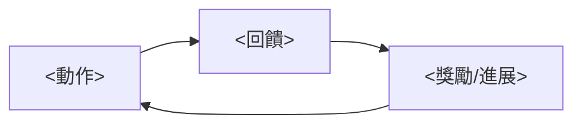

# 北極星 — <專案名稱>

> 由人類核准。量產期 agent **不得修改**本檔；有修改建議請寫在 handover.md 的 HUMAN 區。

## 一句話
<誰> 在 <什麼情境> 中 <做什麼>，感受到 <什麼>。

## 參考圖
| 圖 | 用途 |
|---|---|
| `design/concept/00X-....png` | 視覺產品的主視覺（非視覺產品可省略此表） |
| `design/concept/00X-....png` | 介面或遊戲畫面：構圖與互動 |

## 設計支柱
1. **<支柱>** — 因此我們會 <…>；因此我們不會 <…>。
2. **<支柱>** — …
3. **<支柱>** — …

## 反目標（明確不做）
- <…>

## 核心流程

- 30 秒：<…>
- 5 分鐘：<…>
- 一次完整使用：<…>

## 使用情境與背景（遊戲可包含世界觀）
<摘要，詳細設定可放 design/lore.md>

## 平台與操作
- 平台：<瀏覽器 / 桌機 / 手機>
- 操作：<…>

## 完成的定義（可檢驗）
- [ ] <主要流程可從開始走到結束；遊戲可指定 N 分鐘>
- [ ] <效能：…>
- [ ] <內容量：…>
- [ ] <視覺：截圖與參考圖在色調、鏡頭上一致>

## 決策紀錄
| 日期 | 決策 | 理由 | 提出者 |
|---|---|---|---|
| | | | 使用者 / agent 提議、使用者同意 |
